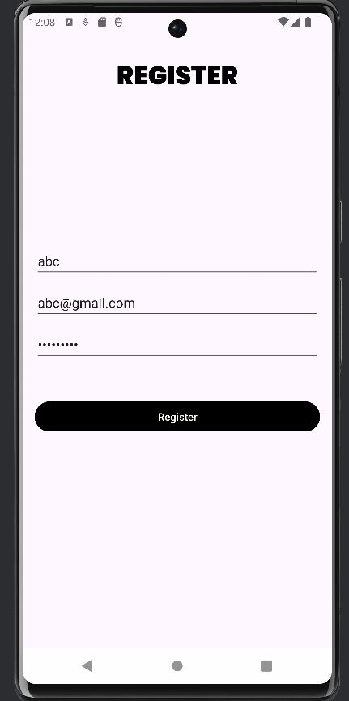

# Android User Management App with SQLite

This project demonstrates user management in an Android app, using **SQLite** for data storage. The app includes a login and registration system, allowing users to register with a username, email, and password. An admin panel is also included to view all registered users.

Watch the Tuturial (Malayalam) and build the app yourself with step by step guide!! <a href="https://youtube.com/playlist?list=PL-OHWgHd2g69PxOxZLLMGdf75gSMl7pG8&si=CodVNyy-HX3uhTCc">Click here</a>
## Features

- **Register**: Users can register with a username (letters only), unique email, and password (at least 8 characters).
- **Login**: Users can log in with their email and password.
- **Admin Panel**: The admin can view a list of all registered users.

## Table of Contents

1. [Screenshots](#screenshots)
2. [Getting Started](#getting-started)
3. [Installation](#installation)
4. [Database Structure](#database-structure)
5. [Activities Overview](#activities-overview)
6. [Admin Panel](#admin-panel)
7. [Contributing](#contributing)

## Screenshots


| Welcome Screen | Register Screen|
|-------------|--------------|
|  |  |

| Login Screen | Home Screen |
|-------------|---------------|
|  |  |

| Admin Screen | Admin Screen (After Login) |
|------------------------|------------------|
|  |  |

## Getting Started

### Prerequisites

- Android Studio (latest version recommended)
- Basic knowledge of Android development, Java, and SQLite
- An emulator or Android device for testing

### Installation

1. **Clone the repository**:
   ```bash
   git clone https://github.com/sreekesh-k/User-Management-App.git
   ```

2. **Open the project**:
   - Open Android Studio and navigate to the cloned project directory.

3. **Build and run**:
   - Connect an Android device or start an emulator.
   - Click the run button in Android Studio to install and launch the app on your device.

## Database Structure

The app uses an `SQLite` database with a single table to store user data.

### User Table Schema

- **Table Name**: `users`
- **Columns**:
  - `id` (INTEGER, PRIMARY KEY, AUTOINCREMENT)
  - `username` (TEXT, no numbers, only a-z, A-Z)
  - `email` (TEXT, must be unique)
  - `password` (TEXT, minimum 8 characters)

### SQLite Database Helper Class

The `DbHandler` class is responsible for managing database creation and versioning. Below are some important methods:

- **Add User**:
   ```java
   public String addUser(String username, String email, String password) { /* ... */ }
   ```

- **Check User Credentials**:
   ```java
   public boolean checkUserEmail(String email, String password) { /* ... */ }
   ```

- **Fetch All Users (Admin)**:
   ```java
   public Cursor getAllUsers() { /* ... */ }
   ```

## Activities Overview

### 1. **RegisterActivity**

- Users can register by providing:
  - Username: Only letters (a-z, A-Z) are allowed.
  - Email: Must be unique.
  - Password: Must be at least 8 characters long.

### 2. **LoginActivity**

- Users can log in by providing their email and password.
- If the credentials match an existing record in the database, the login is successful.

### 3. **AdminActivity**

- The admin panel allows the viewing of all registered users.
- Displays a list with usernames and email addresses.

## Admin Panel

In the Admin Panel, after logging in with valid credentials, the admin can view the list of all registered users. Instead of using a `ListView`, the app displays users in a simple `TextView` by concatenating the user details and setting the text dynamically.

### Code for Fetching Users in AdminActivity

```java
if (dbHandler.checkAdminCredentials(strName, strPassword)) {
    username.setText("");
    password.setText("");
    
    Cursor cursor = dbHandler.listAllUsers();
    String users = "";
    int i = 1;

    if (cursor.moveToFirst()) {
        do {
            // 0-id, 1-username, 2-email, 3-password
            users = userlist.getText().toString(); // Get current text
            users += "\n" + i + ". " + cursor.getString(1) + " - "
                     + cursor.getString(2) + " - "
                     + cursor.getString(3); // Append user data
            i++;
            userlist.setText(users); // Update user list text
        } while (cursor.moveToNext());
    }
}
```

## Contributing

Contributions are welcome! Feel free to fork the repository and open a pull request with your improvements or bug fixes.

### Steps to Contribute

1. Fork the repository.
2. Create a new feature branch (`git checkout -b feature/your-feature`).
3. Commit your changes (`git commit -m 'Add some feature'`).
4. Push to the branch (`git push origin feature/your-feature`).
5. Open a pull request.

---

Feel free to reach out if you have any issues or need further assistance with this project!
